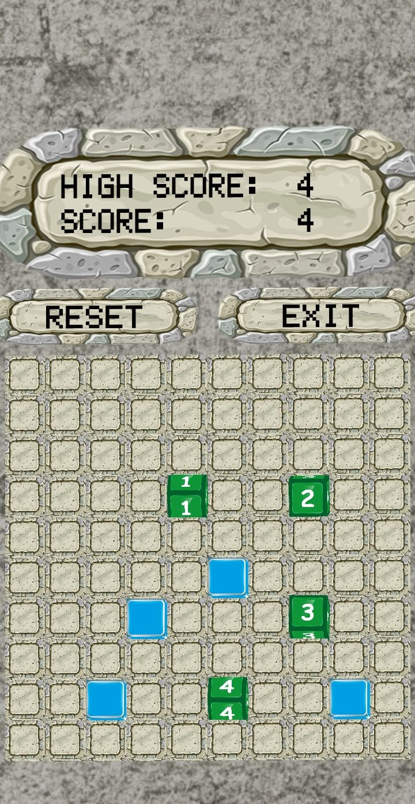

### No100 is a game created by Unity.

- #### This is a game which is played with numbers and  gamer should place the numbers into the boxes .
- #### Once gamer click any box at the beginning, the game starts and the numbers came automatically as long as gamer touches the boxes.
-  #### Rules apply after the first click. Gamer can touch just available boxes. And the blue boxes lead gamer about how he/she should go on.
- #### The simple rules can be seen in the app.
- #### Enjoy it!

